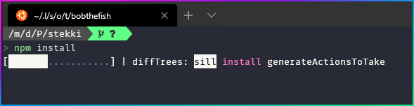

## Creating the website

**This is written in markdown, though it can easily be transferred into a docx format if you request I do so.**

*Markdown is a sort of html replacement, and also a successor to TeX (LaTeX)*

So let's begin!

---

#### Step 1 - getting the right stuff

To being, you're going to need to get the **theme** we're using. Run this command in your preferred terminal.

`git clone https://github.com/BlackrockDigital/startbootstrap-agency stekki/`

This command will copy all the files you need and put them into a folder called **stekki**, which is the name of our project.

Then, all you need to do is run this command and you should have everything more or less ready.

`npm install`

---

#### Step 2 - The Basics

You should have more or less everything you need set up now, so let's get on with the "development".

First of all, run the command `gulp`. This will compile the sass into css, and will start our website. It should automatically open it in your browser but just in case it doesn't, you should find it on `localhost:3000`.

I encourage anyone reading to try changing some text in the html files, as gulp has instant reloading, so any change you make will visible right away.

