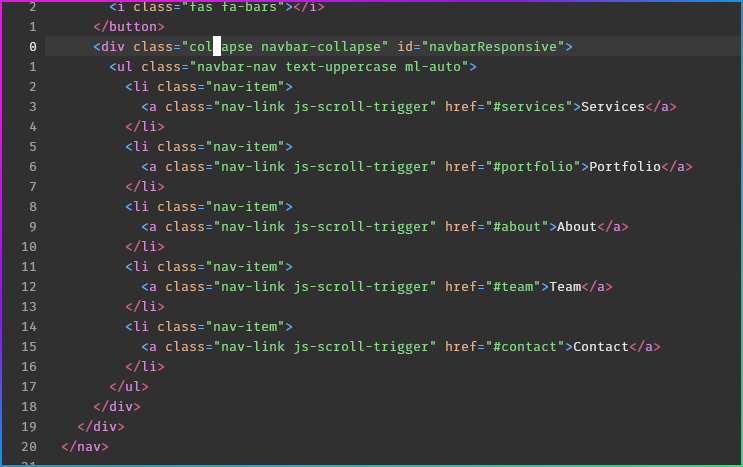

## Creating the website

**This is written in markdown, though it can easily be transferred into a docx format if you request I do so.**

*Markdown is a sort of html replacement, and also a successor to TeX (LaTeX)*

So let's begin!

You can follow along with the code <a href="https://github.com/theqoobee/stekki" target="_blank">here</a>.

## Part 1 - The Basics

#### Step 1 - getting the right stuff

To being, you're going to need to get the **theme** we're using. Run this command in your preferred terminal.
`git clone https://github.com/BlackrockDigital/startbootstrap-agency stekki/`

This command will copy all the files you need and put them into a folder called **stekki**, which is the name of our project.

Then, all you need to do is run this command and you should have everything more or less ready.

`npm install`


---

#### Step 2 - The Basics

You should have more or less everything you need set up now, so let's get on with the "development".

First of all, run the command `gulp`. This will compile the sass into css, and will start our website. It should automatically open it in your browser but just in case it doesn't, you should find it on `localhost:3000`.

I encourage anyone reading to try changing some text in the `html files`, as gulp has instant reloading, so any change you make will visible right away.

So to start, open up the `index.html` file in the main directory, just try changing the title to `stekki`.

The text you should change is located on the *33rd and 11th* lines.

*Note: I'm using vim as my code editor, though you can use whatever you want*


---

#### Step 3 - The Basics Applied

Now that you know how to change text in html, it's time to do something with that knowledge.

This section is going to change some fundamental things on the website, such as the titles, though the other steps will be divided by the sections on the webpage and named accordingly

I will just generally change the text on the website, and replace it with my text, just to get a feel for what it's like to edit this content. So let's start with the big heading on the *64th line*.
Since the layout here is a bit inverted, we'll just change that to say `Stekki`, and we'll change the line directly below it to say `The value of Bosnia`, just like in our design specification.


---

#### Step 4 - Changing colors

As we said in the specifications and most of all discovered through our research, colors are very important to the look and feel of a website, so let's change them up a bit.

In your website directory, you should have a folder called `scss`, and inside that another folder called `base`.
<br> Now I want you to go into that folder and edit a file called `_variables.scss`.

*Note: This is what's called a `sass` file, with it's file extension `scss` being short for `sassy css`. It basically allows us to do some pretty cool things, like we're about to.*


*`_variables.scss` file before and after*

From here, all you need to do is, as shown in the image above, change the `$primary` value to `#D3EEBB`.

You should get something like this!


*Sleek, professional design.*

I chose this specific color due to it being a nice, calming green tone, which represents our country and website quite well.

There's one more place where we need to change the color:
<br> In `scss/components/_buttons.scss` change the color on the last line from `rgba(254, 209, 55, .5)` to `#abdf7e`

This should give us the exact color scheme we want to have here.

---

#### Step 5 - Menu Items

To finish off this section of the essay, lets go ahead and change the menu buttons to say what we want them to say.

Now there are many parts to this page, and we're going to make use of every single one.

So, around `line 32`, you'll see a list of the items looking something like this:



Now you can just change the **white values** to whatever you want and the change should reflect on the site.

Going off of the design specifications, we'll do the following.

`Bosnia | Stekki | History | Coolness | Contact`

And after making the change you should get something along the lines of:


##### *Deviation 1

This is the first time during this project that we deviate a little from our original design.
<br> Even though I thought it was okay, after making it I saw how bad it looked on mobile devices, so we're gonna go with the one that's already here.

## Part 2 - Organization

#### This section focuses on large website changes

We'll mostly just be moving the actual files around and getting everything organized and set up, removing junk that we don't need and such, so you could consider this a little boring- I certainly do, but it is essential.

---

#### Step 1 - The physical files

For this part, I'll be using windows explorer and vim, again, literally anything works.

Now open your working directory, the place with all the files. If you're in a terminal on windows (even using WSL), just doing `explorer.exe .` will work.

The first- and most essential step, is deleting anything ending in `.php`, I will not allow php on the website.
<br> In all seriousness, aside from being a bad language, we will not support php since the free hosting provider we'll be using won't support it. I may just do mailing in javascript later on, but we'll see.

So, I want you to delete the `mail` folder, since we won't be needing it.

// TREMOVE: removed most of the section cause it seemed pointless

#### Step 2 - Erasure

Heading over to your `index.html` file, it's time to get rid of some of it, since it's code we don't need at the moment.

Inside the file, find this snippet of code:

```html
<section class="page-section" id="services">
  <div class="container">
```

Now delete everything between it and:

```html </div>
</section>
```

You should be left with this:

```html
<section class="page-section" id="services">
  <div class="container">

  </div>
</section>
```

Now do the same with the `teams (Coolness)` section. The end result should be:

```html
<section class="bg-light page-section" id="teams">
  <div class="container">

  </div>
</section>
```

And for the last step, delete the entire `teams` section.

Saving and refreshing the page should now reveal two empty sections (plus one missing) where the old ones used to be, which means we have everything we need to build the website, more or less exactly as our design suggests.

## Part 3 - The Layout

This section will cover setting up the layout of the website

So at this point we have everything more or less like we need it, a `blank section`, a section with `some pictures`, a section with a `tree structure` for the history, another blank section, and the `Contact Us` section.

We'll be using bootstrap's grid layout instead of the built in css-flexbox, simply because it's built into this template.

So let's start filling this in!

#### The services section

Go to the `Services` section, the first one we emptied, and add this inside it, just to see the concept.

The way bootstrap works is is divides your website into a grid of rows an columns. Every row is split up into 12 columns, due to the number being very good friends with division. You can have as many rows as you want, but only 12 columns per row.

Below we first define a row, then inside it add `two columns`, each the width of 6, meaning they will each take up half the screen since 6 is half of 12.

```html
<div class="container-fluid">
  <div class="row">
    <div style="background-color: lightgrey;" class="col-6">
      Hello world
    </div>
    <div style="background-color: lightblue;" class="col-6">
      Hello World Two
    </div>
  </div>
</div>
```

Refreshing the page, you should see this:


Pretty basic, huh.

This is more a proof of concept than anything else, so it's time to put some content into this.

So let's add a proper placeholder for now:

*\*Note that the `col-md-6 col-sm-12` indicates that on medium displays (960px+), the sections are going to be next to each other, whereas they'll stack on smaller screens. This is a key point in **responsiveness***

```html
<!-- Services -->
<section class="page-section" id="services">
  <div class="container">
    <div class="row">
      <!-- The text column -->
      <div style="background-color: lightgrey; padding: 10px;" class="col-md-6 col-sm-12">
        <h2>Why are <strong>Stecci</strong> cool?</h2>
        <br>
        <p>This is a basic placeholder to make this look like there's text here so there's text</p> </div>
      <!-- The picture column -->
      <div style="background-color: lightblue; padding: 10px;" class="col-md-6 col-sm-12">
        
      </div>
    </div>
  </div>
</section>
```

Here's what you should get:


I know- it looks like 2002, but hold your horses since this *is* just the layout section. <a href="https://www.saatchiart.com/art/Painting-colourful-landscape/1073491/4153627/view" target="_blank">This</a> is the image used, we're going to change that later, it's temporary, found it on my computer.

Also, notice that if you make the width of your browser window physically smaller, or depending on your pc settings even open the site on your phone, the columns are going to *responsively* stack.

#### The picture section

This is where we run into our next deviation from the design, just looking at this, it's obvious we can do more than what's presented in the design. The reason for this, similar to the first one is first of all design responsiveness, but even more importantly the general feel of the website, why not go a little more advanced.

We will use the already built in `bootstrap modals` to create this section. The idea is the following:

Three pictures displayed in a row, stacked on mobile of course, and upon pressing on one of the pictures a screen should pop up with a description of the place. This is good because

* It's a lot prettier
* It shows off `technical skill`
* Shows stekki in an even brighter light, bringing story to the pictures

Let's get on with it then!

To begin with, we need to **clear out** the stuff we don't need.

Scroll down to the `Portfolio` section, you should notice 6 `div` elements with the class of `portfolio-item`, pick and delete the last three, just so you're left with this.

```html

  <!-- Portfolio Grid -->
  <section class="bg-light page-section" id="portfolio">
    <div class="container">
      <div class="row">
        <div class="col-lg-12 text-center">
          <h2 class="section-heading text-uppercase">Portfolio</h2>
          <h3 class="section-subheading text-muted">Lorem ipsum dolor sit amet consectetur.</h3>
        </div>
      </div>
      <div class="row">
        <div class="col-md-4 col-sm-6 portfolio-item">
        ...
        </div>
        <div class="col-md-4 col-sm-6 portfolio-item">
        ...
        </div>
        <div class="col-md-4 col-sm-6 portfolio-item">
        ...
        </div>
  </section>
```

It's perhaps a little trickier, but now it's time to delete the corresponding modals. Using your editors `find function`, usually bound to CTRL+F (*Every editor has one, even notepad*), you should find the `Portfolio Modals` part of the html documents, it should have modals corresponding to the numbers of the portfolio cards.

Since we deleted the last three above, we do the same here.


If you want to, clear out all the text in the modals, just for easier viewing, though it's optional.

That's all that really need be done here, let's move on to the next section.

#### The history section

Now there are great react and vue UI components for this exact thing, though using a frontend framework is outside of the cope of this "tutorial", so we gotta use what we have- what's already there.

I feel as though just editing the tree structure already present will be more than sufficient, since it will perfectly fit our criteria, so let's skip this for now, since there really isn't anything we need to do about the layout.

#### The 😎 coolness 😎 section

Since, as in the design, it's more or less the same as the first section, just copy that over, not much more to it for now.

```html
<!-- Cool -->
<section class="page-section" id="services">
  <div class="container">
    <div class="row">
      <!-- The text column -->
      <div style="background-color: lightgrey; padding: 10px;" class="col-md-6 col-sm-12">
        <h2>Why are <strong>Stecci</strong> cool?</h2>
        <br>
        <p>This is a basic placeholder to make this look like there's text here so there's text</p>
      </div>
      <!-- The picture column -->
      <div style="background-color: lightblue; padding: 10px;" class="col-md-6 col-sm-12">
        
      </div>
    </div>
  </div>
</section>
```


#### The contact section

There is absolutely nothing we need to change here, so just continue along.

#### *That marks the end of this section, there's not much left.*
---

## Part 4 - Content

Now, this is where we add actual content to the site, so let's get started right away.

#### The Stekki Section

So replace the picture you marked as `nice.jpg` with another one you'd like to use, in my case it's <a href="http://bosnae.info/wp-content/uploads/2017/01/radimlja_visitmycountry.jpg" target="_blank">this</a> one.

<p style="color: red;"><strong>Now I've decided to deviate from my original design and add another image below the first one, this is done to accommodate the empty space on smaller displays due to the aspect ratio of the image itself**</strong> </p>

The difference is that the second image will be "optional", by adding onto it `class="d-lg-none"`, you tell bootstrap not to display it on larger displays.

After that, we need to change the text, the header stays, so I'll just change my `<p>` element to something a little bit more fitting. This is what I came up with, but you're free to use your own text.

```plaintext
Stecci are- and have been, the staple of the great country of Bosnia for almost actual millenia, makking them verified veterans when it comes to touristic attractions.
But- In bosnia, stecci are the least of your concerns, it's the actual experience of visiting there that's really breathtaking, as you'll see in the descriptions below.

Check out the rest of the site to learn more.
```

So, adding that to the site you should get something similar to this:


*\*Note: again, another deviation from the design, I included two pictures since the text was taller than I anticipated*

Still not even remotely pretty, though if you're here for that, skip over to the **styling section**.

#### The Beauty Section

So, to begin with, I'll replace the text saying `Portfolio` with `The Beauty`, and the piece of text below it with
` What's so beautiful about Bosnia? See for yourself.`

Next up, we have to fix those images, I have chosen these three to replace them:

<a href="https://bazerdzan.ba/blogs/blog/stecak-the-true-bosnian-treasure" target="_blank">Pretty</a>,
<a href="https://www.pinterest.com/pin/431360470549566150/" target="_blank">Prettier</a> and
<a href="https://www.pinterest.com/pin/230950287111148367/" target="_blank">The Prettiest</a>

Now I'll just plop the images in there and change the subtexts:


It's nice, though not equal. That's something we'll fix in the styling section.

Let's make the modals prettier too:

This is an example of what I did to the first modal here, it's not complicated, just play around with it and you'll get something nice.

Again, you can view the full code on <a href="https://github.com/theqoobee/stekki" target="_blank">github</a>.

```html
<!-- Modal 1 -->
<div class="portfolio-modal modal fade" id="portfolioModal1" tabindex="-1" role="dialog" aria-hidden="true">
  <div class="modal-dialog">
    <div class="modal-content">
      <div class="close-modal" data-dismiss="modal">
        <div class="lr">
          <div class="rl"></div>
        </div>
      </div>
      <div class="container">
        <div class="row">
          <div class="col-lg-8 mx-auto">
            <div class="modal-body"> <!-- Project Details Go Here --> <h2 class="text-uppercase">Brisk</h2> <p class="item-intro text-muted">Pure, brisk beauty.</p>
              
              <p>The pure brisk beauty of stecci is not described with words, but with pictures. This one in particular was taken in the <strong>Boljuni Necropolis</strong>, one of the places you should surely visit.</p>
              <button class="btn btn-primary" data-dismiss="modal" type="button">
                <i class="fas fa-times"></i>
                Close Image</button>
            </div>
          </div>
        </div>
      </div>
    </div>
  </div>
</div>
```

This is what it looks like:


Actually kinda **okay**.

Now that we've got that done, it's time to get on with doing the tree.

I'll start off by changing the title itself from `about` to `The History`, and the subtext to `The beautiful history of Bosnia and Stecci`

Now the following information comes from
<a href="https://en.wikipedia.org/wiki/Ste%C4%87ak" target="_blank">Wikipedia</a>,
<a href="https://web.archive.org/web/20160308220543/http://whc.unesco.org/en/tentativelists/5607" target="_blank">here</a> and <a href="https://www.itinari.com/unravelling-the-secrets-of-stecci-bosnian-medieval-tombstones-l14a" target="_blank">here</a>.

MLA Citations:

```
"Stećak", 15th July 2018,
  <https://en.wikipedia.org/wiki/Ste%C4%87ak> (28th April 2020)
"Stećaks",
  <http://whc.unesco.org/en/tentativelists/5607> (28th April 2020)
"Unravelling the secrets of stecci", 14th February 2020,
  <https://www.itinari.com/unravelling-the-secrets-of-stecci-bosnian-medieval-tombstones-l14a> (28th April 2020)
```

Note that the last article is one that I used in my research phase.

So just replace the text and the pictures there with your own stuff, here's an example of the first one I did.

Once again, the full code can be found <a href="https://github.com/theqoobee/stekki" target="_blank">here</a>.

```html
<div class="timeline-image">
  
</div>
<div class="timeline-panel">
  <div class="timeline-heading">
    <h4>12th Century</h4>
    <h4 class="subheading">The first Stecci</h4>
  </div>
  <div class="timeline-body">
    <p class="text-muted">What we think to be the first stecc ever created is Grdeša, found in župan of Trebinje. Most likely built by the first inhabitants of the Bosnian heretical church, aside from being very historically important this stecc is a beautiful site to see.</p>
  </div>
</div>
```

Aaaand here's what it looks like:


#### The coolness section

Since this one is the exact same as the first section, we'll do more or less the same thing. I've written some text that shines a beautiful light on stecci and bosnia as a whole, and put two basic pictures in there as well. Here's what it looks like for me.

I'll just add the image priority to the second image, i.e the `class="d-lg-none"` will be on the **first** element.

This is the code:

```html
<div class="row">
  <div style="background-color: lightgrey; padding: 10px;" class="col-md-6 col-sm-12">
    <h2>Stecci <i>are</i> cool.</h2>
    <br>
    <p class="text">As one of the greatest artifacts my country has to offer, containing more history inside each and every one of them than more or less any history book out there, I really do thing <strong>stecci are worth giving a visit.</strong></p>

    <p class="text">It's one hell of an experience in a brand new country, and everyone should visit at least once in their lifetime, since the culture here is unlike <strong>anything you'll ever see</strong>.</p>
  </div>
  <!-- The picture column -->
  <div style="background-color: lightblue; padding: 10px;" class="col-md-6 col-sm-12">
    
    
  </div>
</div>
```

And this is how it looks (for now):


#### The contact section

This time around, there's actually something to do here- change the text, and that we will.

I'll just change it up to be like the design.

Here it is:


#### The copyright section

Let's just change the text in here to say something a little different


Done. Nice 👌

Welp that's the end of the content part, time for styling

## Part 5 - The Style

Half of this looks pretty ugly, so it's time to get our hands dirty with some css.

#### The Stecci and Coolness Section

This is the one we have to do the most work in, though this time instead of going to the index.html file we'll head over to our css.

First of all remove the inline css from your `stecci` and `Coolness` sections in `index.html`. Inline css are the `style=""` parts.

This alone makes it look a surprising amount better.


Next, we'll be editing `sass`, the `.scss` files, as we said earlier, sass is a superset of css, meaning that whatever you're used to doing in css you can do here too, so don't worry about that.

All we'll really do is add borders and margins to the images in these two sections.

To begin with, the stecci section, head over to `[project]/scss/layout/_services.scss`, this is the place where we can edit things that affect theses sections.

Now just below the already present css, you should add the following code:

```css
#services {
  img {
    border: 2px solid $gray-600;
    border-radius: 5px;
    margin: 0.3rem;
  }
}
```

This will make every image inside that section run away from every other a little bit, while also giving them a nice gray border.

Let's add the same code in the `_team.scss` file, though this time we'll remove the code that's already there since we don't need it anymore.

```css
#team {
  img {
    border: 2px solid $gray-600;
    border-radius: 5px;
    margin: 0.3rem;
  }
}
```
